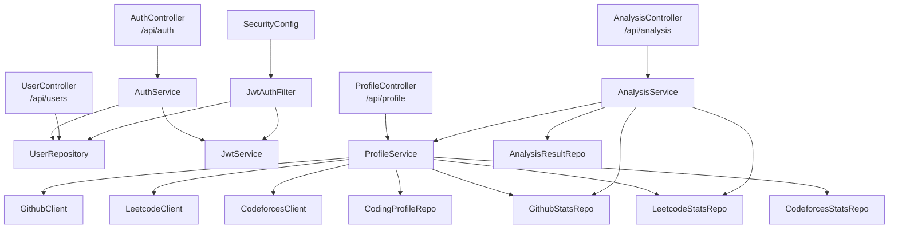
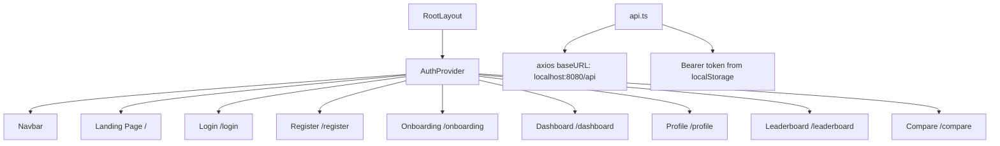

# CodeRank — Full Integration Analysis

> Deep audit of `client-coderank` (Next.js) and `coderank-backend` (Spring Boot) before connecting them.

---

## 1. Architecture Overview

### Backend (Spring Boot 3.3.5 / Java 21)



### Frontend (Next.js 16 / React 19)



---

## 2. API Contract Mapping — Frontend → Backend

| # | Frontend Call | HTTP | Backend Endpoint | Status |
|---|---|---|---|---|
| 1 | `POST /auth/login` | `{email, password}` → expects `{token, user}` | `POST /api/auth/login` → returns `{token, type}` | ⚠️ **MISMATCH** |
| 2 | `POST /auth/register` | `{name, email, password}` → expects redirect | `POST /api/auth/register` → returns `{token, type}` | ⚠️ **MISMATCH** |
| 3 | `GET /auth/me` | expects full User object | **NOT IMPLEMENTED** at `/api/auth/me` | 🔴 **MISSING** |
| 4 | `POST /profile/connect` | `{githubUsername, leetcodeUsername, codeforcesHandle, codechefHandle, atcoderHandle}` | `POST /api/profile/connect` → `{message, profileConnected, githubVerified, leetcodeVerified, codeforcesVerified}` | ⚠️ **PARTIAL** |
| 5 | `GET /profile/me` | expects `{githubUsername, leetcodeUsername, codeforcesHandle}` | `GET /api/profile/me` → returns `ProfileResponse` | ✅ **MATCH** |
| 6 | `POST /analysis/run` | expects `AnalysisResponse` | `POST /api/analysis/run` → returns `AnalysisResponse` | ✅ **MATCH** |
| 7 | `GET /analysis/dashboard` | expects `DashboardResponse` | `GET /api/analysis/dashboard` → returns `DashboardResponse` | ✅ **MATCH** |
| 8 | `GET /analysis/run` (dashboard page) | fetches analysis via GET | Backend only has `POST /api/analysis/run` | 🔴 **MISSING** |
| 9 | `GET /analysis/leaderboard?category=X` | expects `LeaderboardEntry[]` | **NOT IMPLEMENTED** | 🔴 **MISSING** |
| 10 | `GET /analysis/compare?username=X` | expects comparison data | **NOT IMPLEMENTED** | 🔴 **MISSING** |

---

## 3. Critical Mismatches (Detailed)

### 🔴 MISMATCH #1: Auth Login Response

**Frontend expects:**
```typescript
// login/page.tsx line 45
const response = await api.post("/auth/login", values);
login(response.data.token, response.data.user);  // ← expects {token, user}

// AuthContext.tsx — login function:
const login = (token: string, user: User) => { ... }
```

**Backend returns:**
```java
// AuthResponse.java
public class AuthResponse {
    private String token;
    private String type = "Bearer";  // ← NO user object!
}
```

> [!CAUTION]
> The backend `AuthResponse` only returns `{token, type}`. The frontend expects `{token, user}` with a full `User` object (id, name, email, role, createdAt, updatedAt). **Login will fail** — the user state will be null after login.

**Fix needed:** Either expand `AuthResponse` to include a `user` field, or have the frontend make a second call to fetch user data after getting the token.

---

### 🔴 MISMATCH #2: Auth Register — Same Issue

**Frontend expects:**
```typescript
// register/page.tsx line 51
await api.post("/auth/register", { name, email, password });
router.push("/login");  // Redirects to login page
```

This one is **less critical** since the frontend doesn't try to extract `user` from the register response — it just redirects to login. But the login will still have the user problem above.

---

### 🔴 MISSING #3: `GET /auth/me` Endpoint

**Frontend calls:**
```typescript
// AuthContext.tsx line 34
const response = await api.get('/auth/me');
setUser(response.data);
```

**Backend has:** `GET /api/users/me` (UserController), **NOT** `GET /api/auth/me`.

> [!WARNING]
> The URL path is wrong. Frontend calls `/auth/me` but the backend has it at `/users/me`. The `AuthContext` will fail to restore sessions on page refresh — users will be logged out every time they reload.

---

### ⚠️ MISMATCH #4: Onboarding sends extra fields

**Frontend sends:**
```typescript
// onboarding/page.tsx
{
  githubUsername, leetcodeUsername, codeforcesHandle,
  codechefHandle,   // ← NOT in backend DTO
  atcoderHandle     // ← NOT in backend DTO
}
```

**Backend `ConnectProfileRequest` accepts:**
```java
githubUsername, leetcodeUsername, codeforcesHandle  // only 3 fields
```

> [!NOTE]
> This won't cause an error (Spring ignores unknown JSON fields by default), but `codechefHandle` and `atcoderHandle` will be silently dropped. If you plan to support these platforms later, you'll need backend entities/repos for them.

---

### 🔴 MISSING #5: `GET /analysis/run` (Dashboard fetches analysis via GET)

**Frontend dashboard:**
```typescript
// dashboard/page.tsx line 30-33
const [dashRes, analysisRes] = await Promise.all([
  api.get("/analysis/dashboard"),
  api.get("/analysis/run")  // ← GET request!
]);
```

**Backend:** Only has `POST /api/analysis/run`. There is no `GET` variant to retrieve the latest analysis without re-running it.

> [!IMPORTANT]
> This will 405 (Method Not Allowed). Need either a `GET /api/analysis/latest` endpoint on the backend, or change the frontend to use the dashboard response only.

---

### 🔴 MISSING #6: Leaderboard Endpoint

**Frontend calls:**
```typescript
// leaderboard/page.tsx line 30
api.get(`/analysis/leaderboard?category=${category}`)
```

**Backend:** No leaderboard endpoint exists anywhere. Needs a new endpoint that queries `AnalysisResult` and returns ranked users sorted by their scores (overall, dsa, github, or contest depending on the category).

---

### 🔴 MISSING #7: Compare Endpoint

**Frontend calls:**
```typescript
// compare/page.tsx line 30
api.get(`/analysis/compare?username=${encodeURIComponent(friendIdentifier)}`)
```

**Backend:** No compare endpoint exists. Needs a new endpoint that accepts a username/email, fetches both users' analysis results, and returns them side-by-side.

---

### ⚠️ MISMATCH #8: Frontend `User.id` type mismatch

**Frontend type:**
```typescript
export interface User {
  id: number;  // ← number
  ...
}
```

**Backend entity:**
```java
private Long id;  // Java Long → JSON number
```

> [!NOTE]
> This is technically fine since Java `Long` serializes to JSON number. No action needed.

---

### ⚠️ MISMATCH #9: Error Response Shape

**Frontend expects:**
```typescript
err.response?.data?.message  // ← looks for "message" key
```

**Backend GlobalExceptionHandler returns:**
```java
Map.of("error", ex.getMessage(), "timestamp", ...)  // ← key is "error", NOT "message"
```

> [!WARNING]
> The frontend will never display backend error messages properly. It will always fall back to generic messages like "Failed to login. Please try again." The key needs to be aligned — either change backend to use `"message"` or frontend to read `"error"`.

---

### ⚠️ MISMATCH #10: No CORS Configuration

**Backend SecurityConfig:** No CORS configuration at all.

> [!CAUTION]
> The frontend runs on `localhost:3000` and the backend on `localhost:8080`. Without explicit CORS configuration, all API calls from the frontend will be **blocked by the browser**. This is a showstopper.

---

## 4. What's Correctly Aligned ✅

| Area | Details |
|---|---|
| **API Base URL** | Frontend: `http://localhost:8080/api` → Backend: `@RequestMapping("/api/...")` ✅ |
| **JWT Token Storage** | Frontend stores in `localStorage` as `codescore_token`, sends as `Bearer` header ✅ |
| **JWT Token Extraction** | Backend `JwtAuthenticationFilter` reads `Authorization: Bearer <token>` header ✅ |
| **Profile DTO shapes** | `ProfileResponse` (backend) matches `Profile` type (frontend) ✅ |
| **Analysis DTO shapes** | `AnalysisResponse` and `DashboardResponse` both match frontend types ✅ |
| **Profile Connect Flow** | `POST /profile/connect` request body is compatible (extra fields are ignored) ✅ |
| **Register Request Body** | Frontend sends `{name, email, password}` → matches `RegisterRequest` DTO ✅ |
| **Login Request Body** | Frontend sends `{email, password}` → matches `LoginRequest` DTO ✅ |

---

## 5. Summary of Required Fixes Before Integration

### Backend Changes Needed

| Priority | Fix | Description |
|---|---|---|
| 🔴 P0 | **Add CORS config** | Add `@CrossOrigin` or a `WebMvcConfigurer` CORS bean allowing `localhost:3000` |
| 🔴 P0 | **Expand `AuthResponse`** | Add a `user` field with id, name, email, role to the login/register response |
| 🔴 P0 | **Add `GET /api/auth/me`** | OR change frontend to call `/api/users/me` — need a "get current user" endpoint |
| 🔴 P1 | **Add `GET /api/analysis/latest`** | Return latest `AnalysisResult` without re-running analysis |
| 🟡 P2 | **Add leaderboard endpoint** | `GET /api/analysis/leaderboard?category=X` — query all users' scores, rank them |
| 🟡 P2 | **Add compare endpoint** | `GET /api/analysis/compare?username=X` — lookup friend, compare scores |
| 🟡 P3 | **Fix error response key** | Change `"error"` → `"message"` in `GlobalExceptionHandler` for frontend compatibility |

### Frontend Changes Needed

| Priority | Fix | Description |
|---|---|---|
| 🔴 P0 | **Fix `AuthContext` URL** | Change `api.get('/auth/me')` to `api.get('/users/me')` OR wait for backend `GET /auth/me` |
| 🟡 P1 | **Fix dashboard `GET /analysis/run`** | Change to either fetch from a new `GET /analysis/latest` or remove that call |
| 🟡 P3 | **Remove unsupported platform fields** | Onboarding has `codechefHandle` and `atcoderHandle` that backend doesn't support |

---

## 6. File Count Summary

| Codebase | Java/TS Files | Components | Pages |
|---|---|---|---|
| **Backend** | 37 files across 8 modules | N/A | N/A |
| **Frontend** | ~20 files | 11 UI components, 2 layout components | 7 pages (landing, login, register, onboarding, dashboard, profile, leaderboard, compare) |

---

> [!IMPORTANT]
> **I will NOT make any changes until you say.** This is just the analysis. Let me know when you're ready to start fixing things, and in what order you'd like to tackle them.
