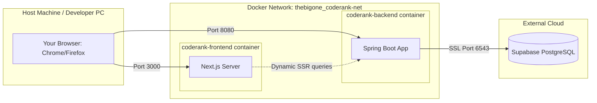

# Understanding Docker Architecture: Images, Containers, and Compose

This guide explains how Docker actually builds, isolates, and runs your frontend (`client-coderank`) and backend (`coderank-backend`) applications.

---

## 1. The Core Concept: Image vs. Container

To understand Docker, you must understand the difference between an **Image** and a **Container**.

```
   [ Dockerfile ]
         │
         │ (docker build)
         ▼
    [ IMAGE ]  ◄─── A read-only blueprint (like a class in Java)
         │
         │ (docker run / compose up)
         ▼
  [ CONTAINER ] ◄─── A live, running process (like an object/instance)
```

*   **Docker Image:** A static, read-only template that contains your code, runtime, libraries, environment variables, and configuration files. Think of it as a zipped-up snapshot of a mini-operating system pre-configured to run your app.
*   **Docker Container:** A runnable instance of an image. It runs isolated from your main operating system in its own sandbox with its own virtualized network interface, ports, and file system.

---

## 2. How the Images are Built (Multi-Stage Builds)

Both your frontend and backend use **Multi-Stage Builds**. This keeps the final production images extremely lightweight by throwing away compile-time tools (like the full JDK or heavy node package managers) before generating the final image.

```mermaid
graph TD
    subgraph Backend Build Flow
        B_Start[eclipse-temurin:21-jdk] --> B_Deps[Download Maven dependencies]
        B_Deps --> B_Compile[Compile Code & Package JAR]
        B_Compile -->|Throw away JDK & target folder| B_Run[eclipse-temurin:21-jre]
        B_Run -->|Only copy app.jar| B_Final[Final Backend Image: ~250MB]
    end

    subgraph Frontend Build Flow
        F_Start[node:22-alpine] --> F_Deps[npm ci - Install packages]
        F_Deps --> F_Compile[next build - Generate standalone code]
        F_Compile -->|Throw away node_modules & dev tools| F_Run[node:22-alpine runtime]
        F_Run -->|Copy standalone JS server| F_Final[Final Frontend Image: ~150MB]
    end
```



---

## 3. How the Containers Run (Docker Compose Architecture)

When you run `docker compose up --build`, Docker starts the containers as isolated virtual processes inside a private, virtual network bridge (`thebigone_coderank-net`).

Here is what the live container runtime architecture looks like:



### Explaining the Ports and Isolation:
1.  **Isolation:** The frontend container has no direct access to the backend container's internal files. The only way they interact is through the virtual network bridge.
2.  **Port Mapping (`host:container`):**
    *   **Frontend (`3000:3000`):** Docker maps your machine's port 3000 to the container's internal port 3000. When you hit `http://localhost:3000` in Chrome, Docker routes it straight into Next.js.
    *   **Backend (`8080:8080`):** Docker maps your machine's port 8080 to the Spring Boot application running inside the container.
3.  **Environment Variables:**
    *   When the backend container boots up, Docker injects the environment variables from the `.env` file directly into the container's RAM.
    *   Spring Boot's `application.properties` reads these variables (like `${DB_URL}`) to establish the database connection pool securely.

---

## 4. Key Takeaways for Local Development

*   **Hot Reloading:** Since containers run on pre-compiled images, any changes you make in your IDE (like changing a Java class or React component) won't show up in the running containers until you tell docker compose to rebuild them:
    ```bash
    docker compose up --build
    ```
*   **Logs:** The logs you see in the terminal are combined outputs from both container stdout streams. Docker prefixes each line with `coderank-backend |` or `coderank-frontend |` so you can tell who is logging what.
*   **Independent Lifecycles:** If you only change backend code, Docker is smart enough to skip rebuilding the frontend image and will reuse the cached layers, making subsequent rebuilds take only seconds.
