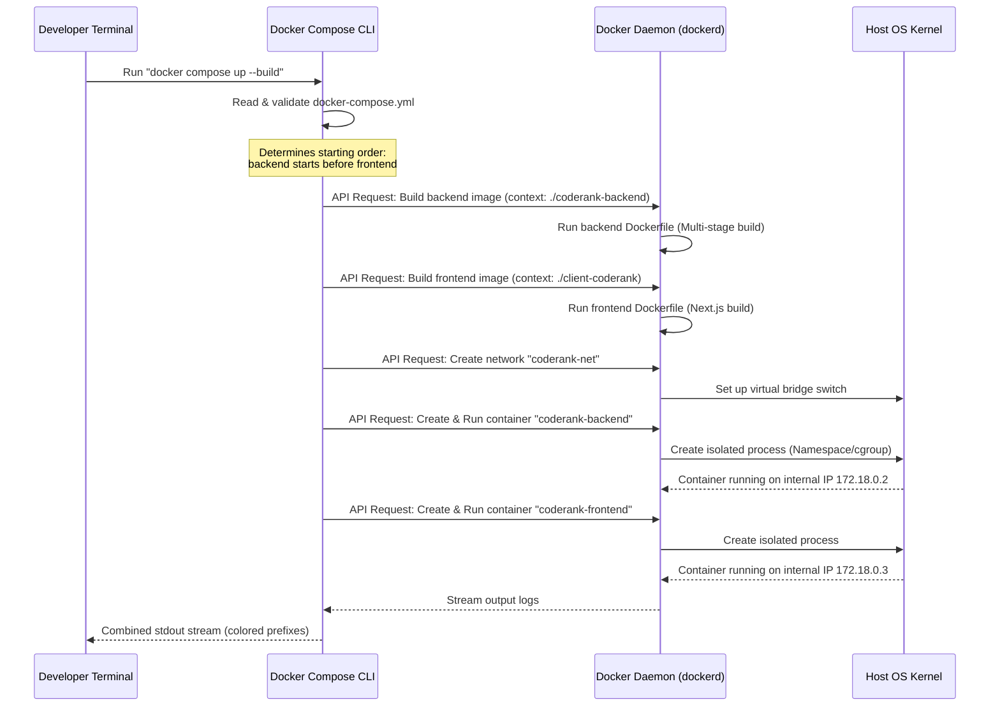

# Deep Dive: How Docker and Docker Compose Work (Expanded)

Docker Compose is a tool for defining and running multi-container applications. To understand how it runs everything with a single command, we first need to look under the hood at the **Docker Client-Server Architecture** and how the **Docker Daemon** coordinates your containers.

---

## 1. The Engine Under the Hood: Docker's Architecture

Docker does not run as a single monolithic command-line tool. It uses a **Client-Server architecture**.

```
  ┌───────────────────────────────────────────────────────────┐
  │                       YOUR MACHINE                        │
  │                                                           │
  │   [ Docker Client ]               [ Docker Compose ]      │
  │   (docker run, etc.)              (docker compose up)     │
  │           │                               │               │
  │           └───────────────┬───────────────┘               │
  │                           │                               │
  │                           ▼ (REST API / Socket / Pipe)    │
  │                                                           │
  │                 [ Docker Daemon (dockerd) ]               │
  │                 (Background System Service)               │
  │                           │                               │
  │         ┌─────────────────┼─────────────────┐             │
  │         ▼                 ▼                 ▼             │
  │    [ Images ]       [ Containers ]     [ Networks ]       │
  │                                                           │
  └───────────────────────────────────────────────────────────┘
```

### A. The Docker Client (CLI)
When you type `docker build`, `docker run`, or `docker compose up`, you are interacting with the **Docker Client**. The client itself does not build images or run containers. Instead, it translates your command into a **REST API call** and sends it to the Docker Daemon.

### B. What is the Docker Daemon (`dockerd`)?
A **daemon** is a computer program that runs as a background process, rather than under the direct control of an interactive user. 

The **Docker Daemon (`dockerd`)** is the brain of Docker. It runs constantly in the background of your operating system. It listens for REST API requests from the Docker Client and does the actual heavy lifting:
- **Managing Images:** Downloads base images, builds new layers, and caches files.
- **Managing Containers:** Tells the host operating system kernel to allocate isolated namespaces and control groups (cgroups) to spin up running container processes.
- **Managing Networks:** Configures virtual ethernet interfaces and bridges so containers can talk.
- **Managing Volumes:** Mounts host folders into container file systems.

---

## 2. Containers vs. Virtual Machines (VMs)

To understand why the Docker Daemon can start both your frontend and backend in seconds compared to a VM, we look at how they virtualize hardware:

| Hypervisor-Based VM (e.g., VirtualBox, VMware) | Container-Based Virtualization (Docker) |
|---|---|
| Virtualizes the hardware. | Virtualizes the operating system. |
| Each VM contains a full **Guest OS** (GBs of size). | Containers share the **Host OS Kernel** directly. |
| Heavy memory overhead, slow boot times (minutes). | Extremely lightweight, boots instantly (seconds). |

```
    VIRTUAL MACHINE (VM)                      CONTAINER (DOCKER)
 ┌─────────────────────────┐               ┌─────────────────────────┐
 │  App A  │  App B  │App C│               │  App A  │  App B  │App C│
 ├─────────┼─────────┼─────┤               ├─────────┼─────────┼─────┤
 │ GuestOS │ GuestOS │Guest│               │  Bins   │  Bins   │Bins │
 ├─────────┴─────────┴─────┤               ├─────────┴─────────┴─────┤
 │       Hypervisor        │               │   Docker Engine (Daemon)│
 ├─────────────────────────┤               ├─────────────────────────┤
 │     Host OS Kernel      │               │     Host OS Kernel      │
 └─────────────────────────┘               └─────────────────────────┘
```

---

## 3. How Docker Compose Orchestrates the Daemon

When you run `docker compose up --build`, the **Docker Compose CLI** acts as a high-level manager that reads your `docker-compose.yml` file and sends a sequence of instructions to the **Docker Daemon**.

Here is the exact timeline of events:



---

## 4. Understanding the `docker-compose.yml` Configuration

Here is how the configuration parameters map to the Daemon's runtime settings:

```yaml
services:
  backend:
    build:
      context: ./coderank-backend  # Instructs Daemon where compilation code lives
    container_name: coderank-backend
    ports:
      - "8080:8080"                # Tells Daemon to forward host port 8080 to container port 8080
    env_file:
      - ./coderank-backend/.env    # Instructs Daemon to load environment variables into container memory
    restart: unless-stopped        # Tells Daemon to automatically run "docker start" if process crashes
    networks:
      - coderank-net               # Attaches container virtual NIC to the bridge network

  frontend:
    build:
      context: ./client-coderank
      args:
        NEXT_PUBLIC_API_BASE_URL: http://localhost:8080/api # Build arguments baked into standalone JS files
    container_name: coderank-frontend
    ports:
      - "3000:3000"
    depends_on:
      - backend                    # Tells Compose CLI not to send frontend start request until backend starts
    restart: unless-stopped
    networks:
      - coderank-net

networks:
  coderank-net:
    driver: bridge                 # Configures the virtual switch to allow intra-container routing
```

---

## 5. Summary of Key CLI commands to command the Daemon

You use the Docker Client CLI to interact with the Docker Daemon:

*   `docker compose up -d`: Instructs the daemon to spin up all containers and run them in **detached** mode (in the background, freeing your terminal).
*   `docker compose down`: Instructs the daemon to stop the container processes, remove them, and destroy the virtual network interfaces cleanly.
*   `docker compose ps`: Queries the daemon for a list of containers managed by this Compose project and their health/status.
*   `docker compose exec backend sh`: Instructs the daemon to open an interactive shell session *inside* the running backend container process.
