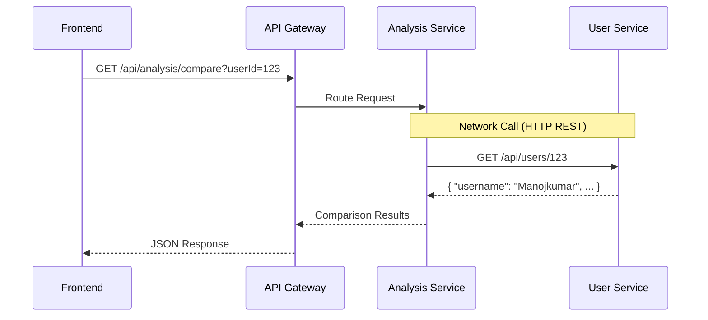

# Understanding Microservices through CodeRank

Welcome! In this guide, we will explore the concept of **Microservices** by analyzing your current `CodeRank` backend architecture. 

Currently, your backend is built as a **Modular Monolith**. Let's break down what that means, and how it serves as a perfect stepping stone to a Microservices architecture.

---

## 1. The Current State: Modular Monolith

Looking at your `coderank-backend/src/main/java/com/coderank` directory, we see the following structure:
- `analysis/`
- `auth/`
- `common/`
- `config/`
- `exception/`
- `profile/`
- `security/`
- `user/`

### What is a Modular Monolith?
A monolithic application is built as a single, unified unit. All the code runs in the same process, uses the same memory space, and connects to the same database.

However, your monolith is **modular**. You have smartly divided your code into distinct business features (e.g., `analysis`, `auth`, `user`). 
- **Pros of your current setup:** It is easy to deploy (just one jar file), simple to test, and straightforward to develop since method calls between modules (like `AnalysisService` calling `UserService`) are just local, in-memory method invocations.
- **The Challenge:** As your application grows, a single server might struggle to handle the load. If the `analysis` feature requires heavy CPU computation, you have to scale the *entire* application, not just the analysis part. Also, a bug in the `auth` module could potentially crash the whole system.

---

## 2. What are Microservices?

**Microservices architecture** is an approach where a single application is composed of many loosely coupled and independently deployable smaller services. 

Instead of all your packages (`auth`, `user`, `analysis`) living in one Spring Boot application, they would each become their own independent Spring Boot application!

### Key Characteristics of Microservices:
1.  **Independent Deployment:** You can update the `analysis` service without redeploying the `auth` service.
2.  **Decentralized Data:** Each microservice should ideally have its own database (or at least its own isolated schema) to prevent tight coupling.
3.  **Communication over Network:** Instead of calling a Java method, services communicate via APIs (like HTTP/REST or gRPC) or message brokers (like Kafka or RabbitMQ).
4.  **Technology Diversity:** The `auth` service could be in Java/Spring Boot, while the heavy `analysis` service could be written in Python or Go.

---

## 3. Designing CodeRank Microservices

If we were to split your current Modular Monolith into Microservices, here is how we could architect it:

### Service 1: Auth Service (Identity Provider)
- **Role:** Handles user registration, login, JWT token generation, and validation.
- **From your code:** The `auth/` and `security/` packages.
- **Database:** A separate database table/schema just for authentication credentials (passwords, usernames, roles).

### Service 2: User Service
- **Role:** Manages user profile information, preferences, and metadata.
- **From your code:** The `user/` package.
- **Database:** Stores user details (Name, email, avatar URL).

### Service 3: Profile Stats Service
- **Role:** Connects to external APIs (LeetCode, GitHub), fetches stats, and caches them.
- **From your code:** The `profile/` package.
- **Database:** Stores the raw stats fetched from platforms.

### Service 4: Analysis & Leaderboard Service
- **Role:** The core engine. It takes the stats, runs comparison algorithms, generates rankings, and provides insights.
- **From your code:** The `analysis/` package.
- **Database:** Stores computed scores and ranking history.

---

## 4. How would they communicate?

In your current application, if `AnalysisService` needs a user's details, it might just do:
```java
// Inside AnalysisService.java
User user = userRepository.findById(userId); 
```
In a microservices world, the Analysis Service doesn't have access to the User database. It must make a network request:



### The API Gateway
Notice the **API Gateway** in the diagram. When you have many small services, the frontend shouldn't need to know the IP address of every single one. The API Gateway acts as a single entry point, routing requests to the correct underlying microservice. (Tools: Spring Cloud Gateway, Nginx, Kong).

---

## 5. The Trade-offs: Is it worth it?

While microservices sound amazing, they add significant complexity.

**The Good:**
- **Scalability:** We can run 10 instances of the `Analysis Service` and only 2 instances of the `User Service` if analysis is CPU-heavy.
- **Fault Isolation:** If the `Profile Stats Service` crashes while fetching LeetCode data, the `Auth Service` stays up, allowing users to still log in.

**The Bad:**
- **Network Latency:** Calling an API over a network is much slower than a local Java method call.
- **Data Consistency:** Managing distributed transactions (e.g., creating a User and an Auth record at the exact same time across two databases) is very hard.
- **DevOps Complexity:** Instead of monitoring one application, you now have to monitor, deploy, and manage logs for 4+ separate applications.

## Conclusion

Your current **Modular Monolith** is actually the **perfect starting point**. 
By keeping your packages (`analysis`, `auth`, `user`) strictly separated right now, you are building clean boundaries. If CodeRank becomes incredibly popular and you need to scale, you can easily pull the `analysis` package out into its own microservice later, because you've already kept its code isolated!
